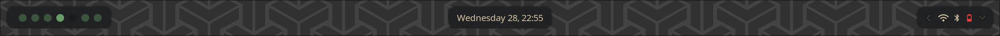
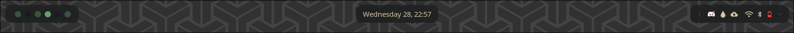
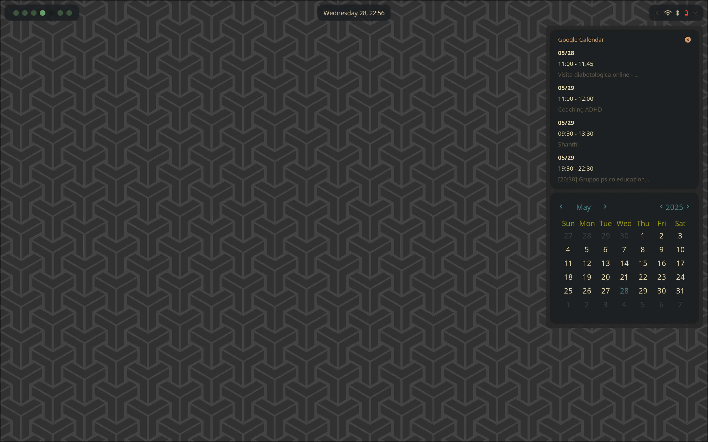

# Reshda Waybar

# Preview



# Dependencies

## Packages
- **hyprpicker**: A tool to select colors from the screen.
- **eww**: A highly customizable widget system for Wayland.
- **python**: A programming language used for various scripts.

## Python Packages
- **colorama**: A library for cross-platform colored terminal text.
- **requests**: A simple HTTP library for Python, used for making API requests.

# Installation
Move the folder `waybar` and `eww` inside your `~/.config/` directory.

# Google Calendar Setup

1. Open [Google Script](https://script.google.com/home/projects).

2. Create a new project.

3. Add the calendar service to the project.

4. Copy the provided script into the project code and deploy it.

```javascript
// The list of calendars I want to fetch information for
const calendarIds = [
    "YOUR CALENDAR ID", // Replace with your calendar ID
];

// Arguments used to fetch calendar information. Change as needed. See
// https://developers.google.com/calendar/v3/reference/events/list for more info
const optionalParams = {
  showDeleted: false,
  singleEvents: true,
  orderBy: 'startTime',
};

const doGet = (event = {}) => {
  const params = {...optionalParams, ...event.parameter};
  const date = new Date();

  if (!params.hasOwnProperty('timeMin')) {
    params['timeMin'] = (new Date(date.getFullYear(), date.getMonth(), 1)).toISOString();
  };
  if (!params.hasOwnProperty('timeMax')) {
    params['timeMax'] = (new Date(date.getFullYear(), date.getMonth() + 1, 0)).toISOString();
  };

  const calendarEvents = calendarIds.flatMap(item => Calendar.Events.list(item, params).items);
  const formattedEvents = calendarEvents.map(event => {
    let start_date = new Date(event.start.dateTime ? event.start.dateTime : event.start.date);
    let end_date = new Date(event.end.dateTime ? event.end.dateTime : event.end.date);
    return {
      'summary': event.summary,
      'description': event.description || '',
      'start_date': start_date.toDateString(),
      'start_date_time': event.start.dateTime || '',
      'end_date': end_date.toDateString(),
      'end_date_time': event.end.dateTime || '',
      'call': event.hangoutLink || '',
      'organizer': event.organizer.email || '',
    };
  });

  return ContentService.createTextOutput(
    JSON.stringify(formattedEvents)
  ).setMimeType(ContentService.MimeType.JSON);
};

```

5. Deploy the script as a web app and set the access to "Anyone".

6. Copy the URL of the deployed script.

7. Create a file called `~/.config/gcalendar/config.json` with the following content:

```jsonc
{
    "endpoint": "YOUR_SCRIPT_URL"
}
```

# License
This project is licensed under the MIT License. See the [LICENSE](./LICENSE) file for details.
